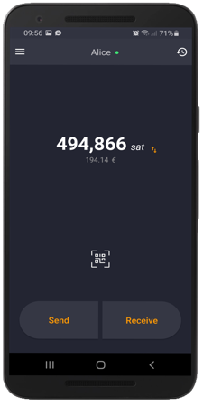

# Zap Android

Native android lightning wallet focused on user experience and ease of use ⚡️

## Features

**Wallet**
- [x] Manage multiple wallets
- [x] Fiat currency prices
- [x] Support for Bech32 and P2SH addresses
- [x] BTC, mBTC, bit & Satoshi units
- [x] Open `lightning:` & `bitcoin:` urls
- [x] Available in many languages
- [ ] Resend failed lightning transactions
- [x] LNURL support (pay, withdraw & channel)
- [x] Transaction filter
- [x] Read NFC tags

**Security**
- [x] PIN protected access
- [x] Scrambled PIN by default
- [x] Protection against screen recording
- [x] Option to hide total balance
- [x] User guardian system (warns the user when he is about to do potentially dangerous actions)
- [ ] Certificate pinning

**Lightning**
- [x] Channel Management
- [x] Connect to remote Lnd node
- [x] Connect to BTCPay Server
- [x] Connect to lndconnect QR code
- [ ] Run lnd on your android phone

## Security

If you discover or learn about a potential error, weakness, or threat that can compromise the security of Zap, we ask you to keep it confidential and [submit your concern directly to the Zap security team](mailto:jimmymowschess@gmail.com?subject=[GitHub]%20Zap%20Security).

## Get Help

If you are having problems with Zap, please report the issue in [GitHub][issues] or on [slack][slack] with screenshots and/or how to reproduce the bug/error.

A good product not only has good software tests but also checks the quality of the UX/UI. Putting ourselves in the shoes of a user is a very important design principle of Zap.

## Contribute

Hey! Do you like Zap? Awesome! We could actually really use your help!

Open source isn't just writing code. Zap could use your help with any of the following:

- [Translating](docs/TRANSLATING.md) the app
- Finding (and reporting!) bugs
- New feature suggestions
- Answering questions on issues
- Documentation improvements
- Reviewing pull requests
- Helping to manage issue priorities
- Fixing bugs/new features

If any of that sounds cool to you, feel free to dive in! [Open an issue][issues] or submit a pull request.

If you would like to help contribute to the project, please see the [Contributing Guide](docs/CONTRIBUTING.md)

If you want to setup a testing environment, please see the [Regtest Guide](docs/REGTEST.md)

And if you want to build the app yourself take a look at the [Installation Guide](docs/INSTALL.md)

## Maintainers
- [Michael Wünsch](https://github.com/michaelWuensch)
- [raph](https://github.com/raphBTC)

## License

This project is open source under the MIT license, which means you have full access to the source code and can modify it to fit your own needs. See [LICENSE](LICENSE) for more information.

[MIT](LICENSE) © Jack Mallers

[issues]: https://github.com/LN-Zap/zap-android/issues
[slack]: https://join.slack.com/t/zaphq/shared_invite/enQtMzgyNDA2NDI2Nzg0LTQwZWQ2ZWEzOWFhMjRiNWZkZWMwYTA4MzA5NzhjMDNhNTM5YzliNDA4MmZkZWZkZTFmODM4ODJkYzU3YmI3ZmI
